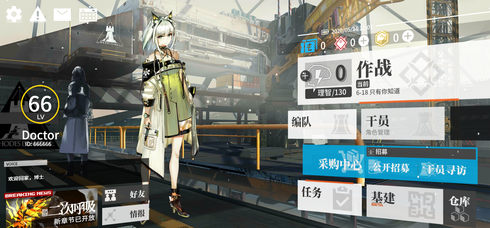

# Arknights UI：H5 + CSS 复刻明日方舟主界面
## Arknights UI: H5 + CSS Arknights Main page

## Demo
<https://g.arknight.xyz/>

## Intro
本项目为 `mashirozx/arknights-ui` 的修改分支. 未来会支持更多功能.
目前已实现的功能
* 循环式背景音乐 Background Music (intro to loop)
* 电池电量显示 Battery info display
* 设置按钮和功能 Settings

## 立绘
立绘下载：<https://s.arknight.xyz>

## TODO
切换立绘、角色台词、支持修改用户信息、游戏等级的扇形图可以用来显示温度等信息、and more...

切换背景图片、背景音乐、其他细节调整

## 版权相关
界面贴图素材都是游戏逆向出来的，仅供学习使用，请勿商用。

## License
© [Mashiro](https://github.com/mashirozx/), Released under the [MIT](https://github.com/mashirozx/arknights-ui/blob/master/LICENSE) License.
